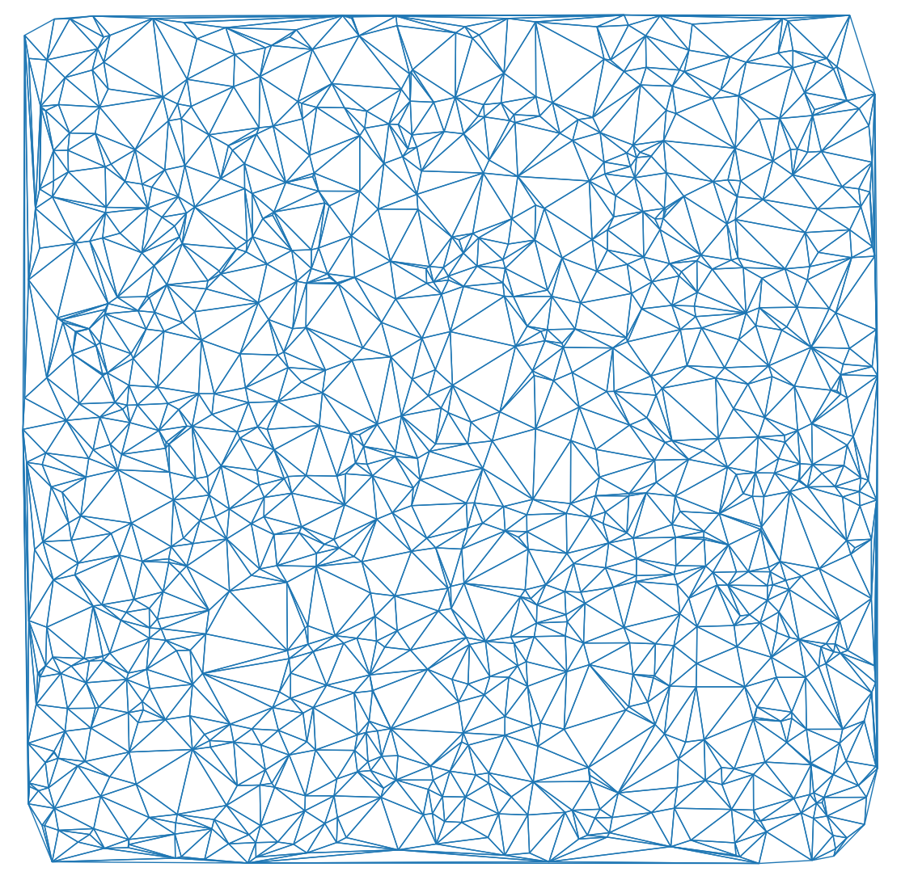
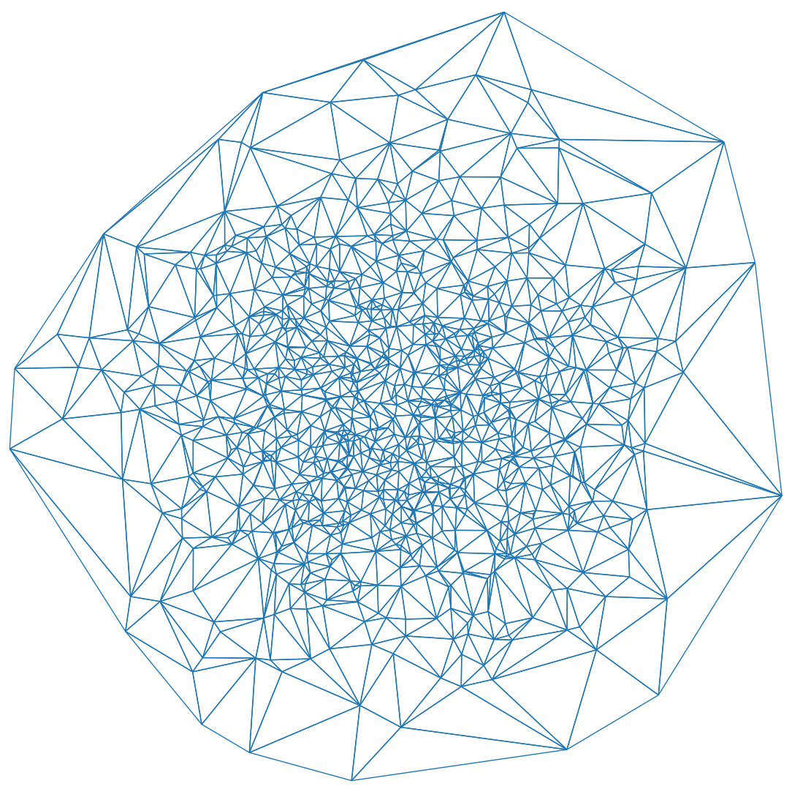

# Delaunay Triangulation Implementation in C++
This repository contains a C++ implementation of the Delaunay triangulation algorithm, a technique used in computational geometry to generate a triangular mesh from a set of points. The triangulation maximizes the minimum angle of all the triangles in the mesh, ensuring that the triangulation is as close to equilateral as possible.

<!-- ... -->

## Example Images

<p float="left">
  
  
</p>

* Example 1 (left): A Delaunay triangulation generated from a set of random points uniformly distributed.
* Example 2 (right): Another Delaunay triangulation with a different set of points based on a normal distribution.

<!-- ... -->

## Prerequisites
* C++ compiler with support for C++17 (e.g., GCC, Clang, or MSVC)
* CMake 3.10 or later

## Building the Project
1. Clone the repository:
```bash
git clone https://github.com/arthurlopes/DelaunayTriangulation.git
cd delaunay-triangulation
```

2. Create a build directory and navigate to it:
```bash
mkdir build
cd build
```

3. Run CMake to generate the build files:
```bash
cmake ..
```

4. Compile the project using the generated build files:
```bash
cmake --build .
```

5. Run the main executable:
```bash
./bin/delaunay-triangulation
```

## Usage
To use the Delaunay triangulation implementation in your own projects, include the src/delaunay.h and src/delaunay.cpp files in your project. Then, execute the `RunDelaunayTriangulation` method with your set of points and target `triangles` vector.

```cpp
#include "delaunay.h"
#include <vector>

int main() {
    std::vector<float2> points = {{0.0, 0.0}, {1.0, 0.0}, {0.0, 1.0}, {1.0, 1.0}, {0.5, 0.5}};

    // Run triangulation
    std::vector<std::shared_ptr<Triangle>> triangles;
    RunDelaunayTriangulation(points, triangles);

    // Do something with the triangulation
}
```

## Contributing
Contributions to improve the implementation, fix bugs, or add features are welcome! Please submit a pull request or open an issue to discuss any changes or report bugs.
